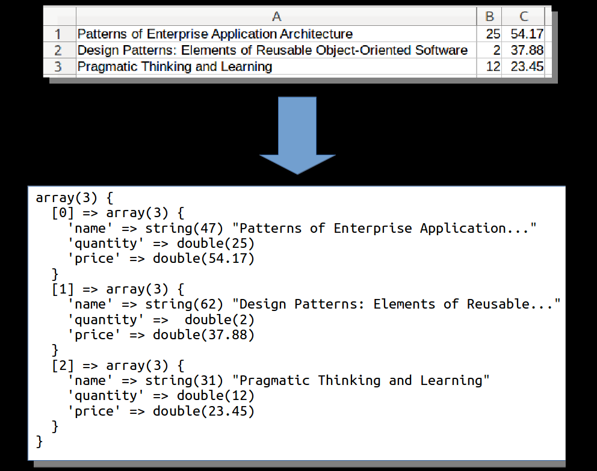

# Loading data from CSV file

## Input

* CSV file `products.csv` contains some products. The first column contains
product name, the second one - quantity in store and the third one - price.

## Steps

* Preparing for extraction: creating CSV reader, iterator, transformer and buffer.
* Reading the data from the CSV file line by line using the Excel iterator.
* Replacing numeric keys by meaningful string keys using the array transformer 
and corresponding naming strategy.
* Dumping the result array to stdout.

